  
  
  

# Projets PPE

Documentation de mes projets réalisés au **Geneva Institute of Technology**, en PPE (Projet Personnel Encadré) et dans le cadre du cours IT Essentials, pendant ma première année de CFC d'informaticien.

Chaque dossier contient une fiche complète : contexte du projet, étapes réalisées, captures d'écran, incidents rencontrés et résolutions.

## Projets

| Projet | Description |
|---|---|
| [Projet 1 — Fiche de mise en service](./projet-1-fiche-mise-en-service) | Mise en service d'un poste de travail (PC-COMPTA-01) pour un cabinet comptable |
| [Projet 2 — Poste multi-utilisateurs](./projet-2-poste-multi-utilisateurs) | Configuration d'un poste partagé pour salle informatique, avec profils utilisateurs séparés |
| [Projet 3 — Migration et sauvegarde](./projet-3-migration-sauvegarde) | Migration et sauvegarde des données d'un poste existant |
| [Projet 4 — Dépannage et diagnostic](./projet-4-depannage-diagnostic) | Diagnostic et résolution d'une panne sur un poste de travail |
| [Projet 5 — Déploiement standardisé](./projet-5-deploiement-standardise) | Déploiement d'un poste à partir d'une image système standardisée |

---

## Voir aussi

- [Infrastructure VMware en équipe](https://github.com/dnhj-06/cluster-vsphere) : 3 serveurs ESXi, vCenter et Active Directory
- [Mon CV et mes contacts](https://dnhj-06.github.io)
- [← Retour à mon profil](https://github.com/dnhj-06)
